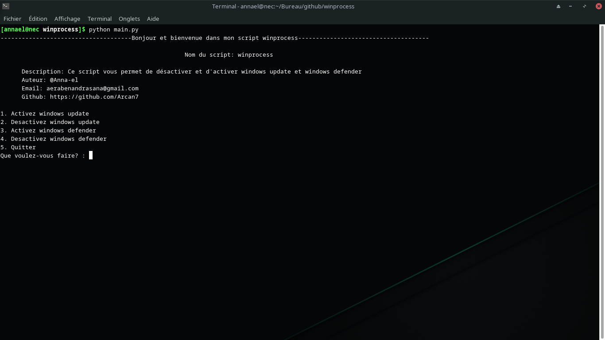

# winprocess

Bonjour et bienvenue sur le projet winprocess.

## About
Winprocess est un projet qui permet de désactiver ou activer windows defender et windows update. <br>

Il est disponible en version 1.0.0, script python.

Pour les version suivantes, je vais ajouter une interface graphique ou bien si vous voulez contribuer, vous pouvez le faire et aussi une version en .exe sera disponible.

## Authors

- [@Anna-el](https://github.com/Arcan7)


## Tech

- Python


## Run Locally

Clone the project

```bash
  git clone https://github.com/Arcan7/winprocess.git
```

Go to the project directory

```bash
  cd winprocess
```

Run dependencies

```bash
  python main.py
```

## Screenshots



